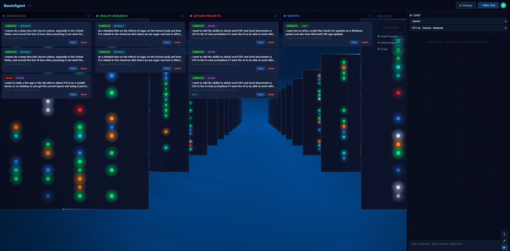

# BaumAgent

A self-hosted AI agent portal that autonomously completes software engineering, research, and document tasks. Submit a task, pick an LLM backend, and BaumAgent will get to work — cloning repos, writing code, opening pull requests, conducting deep research, or drafting structured documents — all while streaming live logs to the UI.

---

## Screenshot



---

## Quick Start

### Prerequisites
- Docker + Docker Compose
- Git

### 1. Clone the repo

```bash
git clone https://github.com/Bruiserbaum/BaumAgent.git
cd BaumAgent
```

### 2. Configure environment

```bash
cp .env.example .env
```

Open `.env` and fill in your keys:

```env
ANTHROPIC_API_KEY=sk-ant-...       # Optional — leave blank if using OpenAI or Ollama only
OPENAI_API_KEY=sk-...              # Optional — leave blank if using Anthropic or Ollama only
GITHUB_TOKEN=ghp_...               # Required — needs repo + pull_request scope
GITHUB_USER_NAME=BaumAgent         # Name shown on commits
GITHUB_USER_EMAIL=you@example.com  # Email shown on commits
OLLAMA_BASE_URL=http://ollama:11434 # Change if Ollama runs elsewhere
```

Generate a GitHub token at: https://github.com/settings/tokens → Classic → check `repo`

### 3. Create data directories

```bash
mkdir -p data/db data/repos data/redis
```

### 4. Start the stack

```bash
docker compose up -d --build
```

The `--build` flag triggers the multi-stage Docker build, which compiles the React frontend automatically using Node.js inside the build container — no Node.js required on the host. This starts three containers: `baumagent-api`, `baumagent-worker`, and `baumagent-redis`.

The UI is available at `http://your-server-ip:8100`.

### 5. Verify it's running

```bash
docker compose logs -f
```

You should see `Uvicorn running on http://0.0.0.0:8000` from the api container and `Worker rq:worker` from the worker container.

---

## Updating

```bash
git pull
docker compose up -d --build
```

---

## Deploying via Portainer

1. Go to **Stacks → Add stack → Repository**
2. Fill in:

| Field | Value |
|-------|-------|
| Repository URL | `https://github.com/Bruiserbaum/BaumAgent` |
| Repository reference | `refs/heads/main` |
| Compose path | `docker-compose.yml` |

3. Under **Environment variables**, add all values from `.env.example`
4. Click **Deploy the stack**

> The frontend is built automatically during the Docker image build — no Node.js needed on the Portainer host.

---

## Environment Variables

| Variable | Default | Description |
|---|---|---|
| `ANTHROPIC_API_KEY` | _(empty)_ | Anthropic API key |
| `OPENAI_API_KEY` | _(empty)_ | OpenAI API key |
| `GITHUB_TOKEN` | **required** | GitHub personal access token with `repo` scope |
| `GITHUB_USER_NAME` | `BaumAgent` | Git commit author name |
| `GITHUB_USER_EMAIL` | `baumagent@localhost` | Git commit author email |
| `OLLAMA_BASE_URL` | `http://ollama:11434` | Ollama API base URL |
| `DATABASE_URL` | `sqlite:////app/data/baumAgent.db` | SQLAlchemy database URL |
| `REDIS_URL` | `redis://redis:6379/0` | Redis connection URL |

---

## Task Types

### GitHub Code Task
The agent clones a repository, implements the requested change, pushes a branch, and opens a pull request.

Options:
- **Delivery mode** — PR (default) or direct push
- **Build after change** — run the project's build/test step before pushing
- **Create release artifacts** — tag and upload a release after a successful build
- **Update docs / changelog** — keep documentation in sync automatically

### Research
The agent uses web search to research a topic and produces a structured report.

- **Standard** — balanced overview with sources
- **Deep Study** — authoritative, direct-answer format with primary source quotes, contrast analysis, and a straight answer conclusion

### Structured Document
The agent drafts a formal document (plan, proposal, RFC, report, spec) using a guided template.

Configurable sections: audience, purpose, background, constraints, timeline, budget, stakeholders, risks, alternatives, success measures, executive summary, and appendix.

---

## Supported LLM Backends

### Anthropic
| Model | Category | Cost |
|-------|----------|------|
| claude-opus-4-6 | General | High |
| claude-sonnet-4-6 | General | Moderate |
| claude-haiku-4-5 | General | Low |
| claude-3-7-sonnet-20250219 | General | Moderate |
| claude-3-5-sonnet-20241022 | General | Moderate |
| claude-3-5-haiku-20241022 | General | Low |
| claude-3-opus-20240229 | General | High |
| claude-3-sonnet-20240229 | General | Moderate |
| claude-3-haiku-20240307 | General | Low |

### OpenAI
| Model | Category | Cost |
|-------|----------|------|
| gpt-4o | General | Moderate |
| gpt-4o-mini | General | Low |
| o1 | Reasoning | High |
| o3-mini | Reasoning | Low |

### Ollama (self-hosted)
Any model loaded in your Ollama instance is available — fetched live from the API. Models are automatically classified by name pattern (coding, reasoning, fast, general).

---

## Projects

Tasks can be grouped into **Projects** — colour-coded kanban columns on the dashboard. Assign tasks to a project when creating them, or reassign them afterward from the task card.

---

## AI Chat

The sidebar AI Chat panel lets you converse directly with any configured LLM. Supports:
- **Document attachments** — PDF, Word (.docx), Excel (.xlsx/.xls), CSV
- **Image attachments** — screenshots or diagrams alongside your message
- **Project context** — pin a project to keep conversations organised

### Supported attachment formats

| Format | Extensions |
|--------|-----------|
| PDF | `.pdf` |
| Word | `.docx` |
| Excel | `.xlsx`, `.xls` |
| CSV | `.csv` |
| Images | `.png`, `.jpg`, `.webp`, `.gif` |

---

## Connecting to Existing Ollama in BaumDocker

If you run Ollama as part of your homelab stack on a shared Docker network (e.g. `ai_backend`), set `OLLAMA_BASE_URL` to `http://ollama:11434` and join BaumAgent to that network:

```yaml
networks:
  baumagent:
    name: baumagent
  ai_backend:
    external: true
```

Add both networks to the `api` and `worker` services in `docker-compose.yml`.

---

## Authentik Forward Auth

BaumAgent does not implement authentication itself — protect it with Nginx Proxy Manager and Authentik forward auth:

1. In Authentik, create a **Proxy Provider** (Forward Auth Single Application) for your BaumAgent domain.
2. Create an **Application** pointing to that provider.
3. In NPM, add a proxy host pointing to `baumagent-api:8000` and add the Authentik forward auth advanced config snippet.

All requests will be gated by Authentik before reaching BaumAgent.

---

## Agent Tools

The agent has access to: `list_dir`, `read_file`, `write_file`, `delete_file`, `web_search` (DuckDuckGo), and `finish`.

---

## License and Project Status

This repository is a personal project shared publicly for learning, reference, portfolio, and experimentation purposes.

Development may include AI-assisted ideation, drafting, refactoring, or code generation. All code and content published here were reviewed, selected, and curated before release.

This project is licensed under the Apache License 2.0. See the LICENSE file for details.

Unless explicitly stated otherwise, this repository is provided as-is, without warranty, support obligation, or guarantee of suitability for production use.

Any third-party libraries, assets, icons, fonts, models, or dependencies used by this project remain subject to their own licenses and terms.
